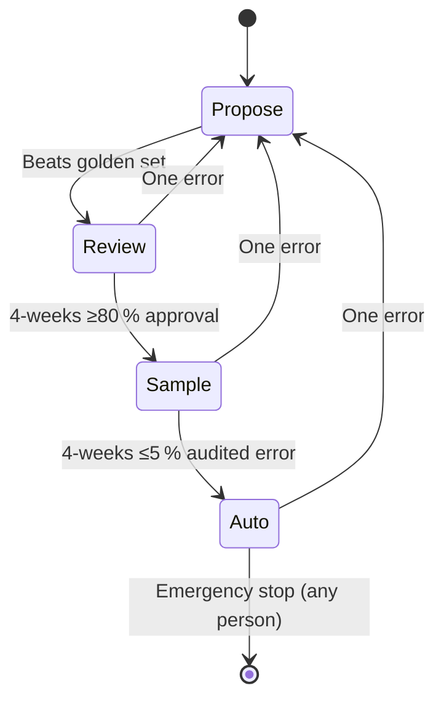

# Autonomy Ladder

The autonomy ladder is how an agent, human, or vendor tool earns increasing levels of independence based on verified outcomes. Promotion requires evidence; demotion is immediate on error.

*Source: GTM OS Blueprint (DOC GTM-OS-001 · REV K · 2026-07-29)*

## Four Rungs

Agents hold one of four rungs: **propose**, **review**, **sample**, or **auto**. Each rung states who acts and who checks, turning autonomy from a mood into a setting with a value.

| Rung | Who Acts | Who Checks | Promotion Evidence | Demotion Trigger |
|------|----------|------------|--------------------|------------------|
| **1. Propose** | The agent drafts; a human performs the output. | A person approves the output. | Beats the golden set (replays recorded dispositions and matches the record a person produced). | One error demotes immediately to **Propose** (cannot go lower). |
| **2. Review** | The agent performs the work; a person approves each output. | A person has approved 4 weeks of output inside the 80–98 % approval band. | Sustained approval rate (e.g., ≥80 % for 4 weeks). | One error demotes immediately to **Propose**. |
| **3. Sample** | The agent runs alone; a designated owner audits a random slice. | Audited error rate ≤5 % for 4 more weeks. | Sustained audited error rate (e.g., ≤5 % for 4 weeks). | One error demotes immediately to **Propose**. |
| **4. Auto** | The agent runs alone under telemetry. | Telemetry shows the switch is live and the agent stays within error bounds. | (Implicit from Sample promotion.) | One error demotes immediately to **Propose**; any person may pull the emergency stop switch to halt all execution. |

## Key Properties

- **Promotion requires evidence** – you never raise your own rung; you must show results against declared thresholds in the policy files (`IN-601`, `BO-501`).
- **Demotion is immediate** – one error crosses an agent down one rung right away, and the system owner reviews before any re‑promotion (FM-701 already bars an agent from raising its own level).
- **The emergency stop** – any person on the team may pull the switch that stops all execution without approval.
- **Autonomy never exempts a send** – every message still passes the send gate (claims, brand, policy) regardless of rung.

## Example: An Agent’s Journey

Here’s how a fresh agent might move through the ladder.

1. **Start at Propose**  
   The agent loads a skill (e.g., scoring rules) and drafts an output. A human performs the action (e.g., writes the email) and approves it. After beating the golden set, the agent is promoted to **Review**.

2. **Earn Review**  
   The agent now performs the work (e.g., runs the scoring skill and logs the disposition), and a person approves each output. After 4 weeks of sustained approval (≥80 %), the agent is promoted to **Sample**.

3. **Reach Sample**  
   The agent runs alone, and a designated owner audits a random slice of its output. If the audited error rate stays ≤5 % for 4 weeks, the agent is promoted to **Auto**.

4. **Operate at Auto**  
   The agent runs alone under telemetry. One error demotes it immediately back to **Propose**; the system owner reviews before any re‑promotion.

## Diagrams

Below is a mermaid state diagram showing the ladder and transitions.

## Worked Example: Example for Autonomy Ladder

Here’s a concrete example of how autonomy ladder works in practice.

1. **Scenario Setup**
   - Describe the starting state: goal, progress, evidence.
2. **Step 1: [First Action]**
   - What the agent does.
3. **Step 2: [Second Action]**
   - What happens next.
4. **Step 3: [Third Action]**
   - The outcome and verification.
5. **Result**
   - The final state and what was learned.

## Objection/Layer: What Could Break This and How We Mitigate

| Potential Failure | How It Happens | Mitigation in the OS |
|-------------------|----------------|----------------------|
| **Failure mode 1** | Description. | Mitigation. |
| **Failure mode 2** | Description. | Mitigation. |
| **Failure mode 3** | Description. | Mitigation. |

## Related Pages

- [GTM OS Architecture](../agentic/00-gtm-os-architecture.md): Shows the 4‑layer model that the autonomy ladder operates within.
- [Engagement Flow](../flows/engagement-flow.md): Shows how dispositions flow through the layers and produce the ledger that informs promotion/demotion.
- [Examiner Deep Dive](./examiner.md): Shows how the examiner uses the ledger to validate changes.
- [Repo Structure](./gtm-os-repo-structure.md): Shows the file tree (`icp/`, `personas/`, `plays/`, `skills/`, `scoring.md`, `policies/`, `evals/`).

> _“Autonomy is earned one rung at a time.”_ - GTM OS Blueprint