# Build Order

The GTM OS is built in **five phases**. Each phase must be solid before moving to the next. Violating the order leads to volume without learning, brittle automations, and a system that cannot improve.

## Five Phases

| Phase | Goal | Key Artifacts | Exit Criteria |
|-------|------|---------------|---------------|
| **0 – Foundations** | Define the core motion elements. | `icp.md`, `personas/`, `plays/` (skeleton), `skills/` (core), `scoring.md` (baseline), `policies/` (baseline). | All foundational files exist and are versioned. No execution yet. |
| **1 – Engagement & Disposition Ledger** | Run the motion manually and capture every outcome as a disposition. | Manual execution log, disposition ledger schema, initial `evals/` (golden set seed). | You have a disposition ledger with at least 100 verified outcomes. |
| **2 – Examiner & Skill Library** | Build the examiner and begin turning repeated procedures into skills. | Examiner harness, skill template, first few skills (prospecting, outreach, enrichment). | The examiner can load the golden set, replay a skill, and return a verdict. |
| **3 – Close the Loop** | Ensure the disposition ledger feeds back into skill improvement via the examiner. | Closed-loop scripts, disposition → skill update workflow, versioned skill updates. | A change to a skill triggers the examiner, which returns evidence, and the skill is updated in a PR. |
| **4 – Outreach Automation** | Automate the motion while preserving the feedback loop. | Outreach skill (sequences, timing), connectors (CRM, SEP), automation harness. | Automated runs produce dispositions that flow into the ledger; the examiner still catches regressions. |
| **5 – Agentic Scaling** | Replace human-in-the-loop steps with agents that earn autonomy. | Agent configs, autonomy ladder, agent approval workflows, kill switch. | Agents operate at rung 3 (sample) or higher, and the human only intervenes on escalation. |

## Why the Order Matters

### ❌ If you automate outreach before closing the loop (Phase 4 before Phase 3)

- You generate **volume without learning**. The disposition ledger is sparse or biased, so the examiner has little to work with.
- Any change to outreach (e.g., a new sequence) cannot be validated against outcomes because the loop is broken.
- You end up with a brittle automation that improves vanity metrics (messages sent) but not outcomes (meetings booked, deals closed).

### ❌ If you build skills before capturing dispositions (Phase 2 before Phase 1)

- Skills are built on assumptions, not on real outcomes. The examiner has nothing to validate against.
- You may end up with skills that look good in isolation but fail in the wild.

## How to Enforce the Order

The **quality gate** (question 4) enforces the build order. A custom script checks that no PR introduces a forward dependency.

- Adding a file under `skills/outreach/` before the disposition ledger has a sufficient number of verified outcomes (configurable threshold) will fail.
- Adding an automation harness (e.g., a cron that runs sequences) before the examiner is operational will fail.

## Diagrams

Below is a flowchart showing the build order and feedback loops.

```mermaid
flowchart LR
    A[Phase 0: Foundations] --> B[Phase 1: Engagement & Ledger]
    B --> C[Phase 2: Examiner & Skill Library]
    C --> D[Phase 3: Close the Loop]
    D --> E[Phase 4: Outreach Automation]
    E --> F[Phase 5: Agentic Scaling]
    style A fill:#f9f,stroke:#333,stroke-width:2px
    style B fill:#bbf,stroke:#333,stroke-width:2px
    style C fill:#bfb,stroke:#333,stroke-width:2px
    style D fill:#ff9,stroke:#333,stroke-width:2px
    style E fill:#f99,stroke:#333,stroke-width:2px
    style F fill:#9f9,stroke:#333,stroke-width:2px
```

## Example: Violating the Order

A PR adds a new outreach sequence under `skills/outreach/sequences/` while the disposition ledger has only 20 verified outcomes (below the threshold of 100).

- The quality gate’s build-order check runs and returns:
  - **Failed question**: 4 (Build order)
  - **Evidence**: “Outreach automation added before disposition ledger reached 100 verified outcomes. Current count: 20.”
- The PR is blocked, and the author must either wait until the ledger has enough outcomes or provide evidence that the sequence is safe to add (e.g., it is a pure copy of an existing sequence with no behavioral change).

## Worked Example: Example for Build Order

Here’s a concrete example of how build order works in practice.

1. **Scenario Setup**
   - Describe the starting state: goal, progress, evidence.
2. **Step 1: [First Action]**
   - What the agent does.
3. **Step 2: [Second Action]**
   - What happens next.
4. **Step 3: [Third Action]**
   - The outcome and verification.
5. **Result**
   - The final state and what was learned.

## Objection/Layer: What Could Break This and How We Mitigate

| Potential Failure | How It Happens | Mitigation in the OS |
|-------------------|----------------|----------------------|
| **Failure mode 1** | Description. | Mitigation. |
| **Failure mode 2** | Description. | Mitigation. |
| **Failure mode 3** | Description. | Mitigation. |

## Related Pages

- [Quality Gate](./quality-gate.md) – how the gate enforces the build order.
- [Examiner Deep Dive](./examiner.md) – how the examiner validates changes.
- [Autonomy Ladder](./autonomy-ladder.md) – how agents earn the right to approve changes.
- [Controls](./controls.md) – failure modes and mitigations.

---