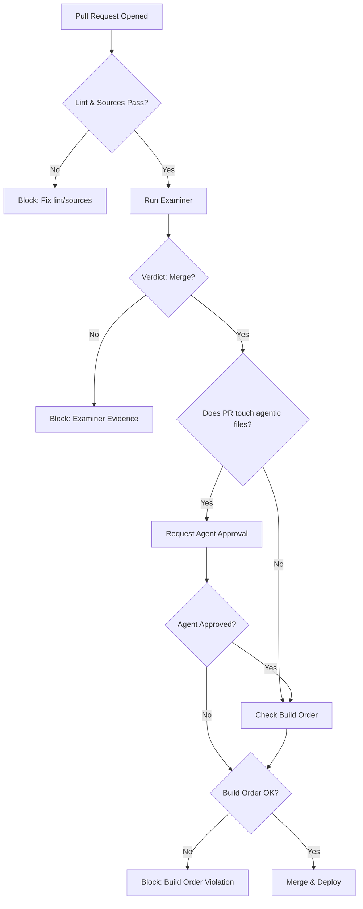

# Quality Gate

The quality gate is the final checkpoint that decides whether a proposed change to the motion may be deployed. It combines human judgment, agentic oversight, and automated verification to ensure that every change adheres to the operating system’s principles.

## Four Questions

Every change must answer **yes** to all four questions before it can proceed. If any answer is **no**, the change is blocked and returned with evidence.

1. **Is the change recorded as a versioned file in the operator’s repository?**  
   → Ensures the motion stays as code, not tribal knowledge.

2. **Does the change pass the examiner?**  
   → The examiner replays the change against the outcome ledger and returns a verdict (merge/block with evidence). No change deploys on trust.

3. **Does the change have agent approval (if the change affects agent behavior)?**  
   → For changes that touch skills, prompts, or agent-facing policies, an authorized agent must review and approve the change. This ensures the agent’s autonomy ladder is respected and that the agent’s trust in the system is not violated.

4. **Does the change satisfy the build order?**  
   → The change must not violate the recommended build order (see [Build Order](#build-order)). For example, you may not automate outreach (phase 4) before closing the loop (phase 3) is solid.

## How the Gate Works

When a pull request is opened, the following sequence runs automatically:

1. **Lint & source check** – the CI runs `npm run lint` and `npm run check:sources`. Failures block the PR.
2. **Examiner run** – the harness loads the proposed changes, retrieves the golden set from the ledger, replays the motion, and computes the verdict.
3. **Agent approval request** – if the PR touches agentic files (skills/, prompts/, agent-config/), a notification is sent to the designated agent reviewer. The PR cannot merge until the agent approves.
4. **Build order validation** – a custom script checks that the change does not introduce a forbidden forward dependency (e.g., adding an outreach sequence before the disposition ledger is validated).
5. **Final merge** – if all checks pass, the PR is merged and the change is deployed through the runtime.

## Agent Approval Flow

Agent approval is not a rubber stamp. The agent must:

- Review the changed files for consistency with the agent’s current autonomy rung.
- Run a local test harness (if provided) to ensure the change does not break the agent’s expected behavior.
- Sign off with a comment that includes the agent’s identifier and the timestamp.

If the agent rejects the change, they must provide evidence (e.g., “this prompt change would cause the agent to hallucinate pricing details”) and suggest a revision.

## Evidence on Block

When the gate blocks a change, it returns a structured evidence packet:

- **Which question failed** (1‑4)
- **Examiner output** (if question 2 failed): which accounts would have re‑ranked, which sends would have been blocked, etc.
- **Agent feedback** (if question 3 failed): the agent’s review comments.
- **Build order violation** (if question 4 failed): the specific rule that was broken.

This evidence is attached to the PR as a comment and is also stored in the `evals/` directory for future reference.

## Diagrams

Below is a flowchart showing the quality gate process.

## Example: Blocked Change

A proposed change to the scoring rule that would increase weight on firmographic fit is submitted.

- **Question 1**: Passed – the change is a versioned file in `skills/scoring-rules.md`.
- **Question 2**: The examiner runs and finds that the change would have blocked 23 past winning sends (evidence attached).
- **Result**: Blocked at question 2. The PR is not merged, and the examiner’s evidence is posted.

## Worked Example: Example for Quality Gate

Here’s a concrete example of how quality gate works in practice.

1. **Scenario Setup**
   - Describe the starting state: goal, progress, evidence.
2. **Step 1: [First Action]**
   - What the agent does.
3. **Step 2: [Second Action]**
   - What happens next.
4. **Step 3: [Third Action]**
   - The outcome and verification.
5. **Result**
   - The final state and what was learned.

## Objection/Layer: What Could Break This and How We Mitigate

| Potential Failure | How It Happens | Mitigation in the OS |
|-------------------|----------------|----------------------|
| **Failure mode 1** | Description. | Mitigation. |
| **Failure mode 2** | Description. | Mitigation. |
| **Failure mode 3** | Description. | Mitigation. |

## Related Pages

- [Examiner Deep Dive](./examiner.md) – how the examiner works.
- [Autonomy Ladder](./autonomy-ladder.md) – how agents earn approval rights.
- [Build Order](./build-order.md) – the recommended sequence for building a GTM OS.
- [Controls](./controls.md) – failure modes and how the gate mitigates them.

---