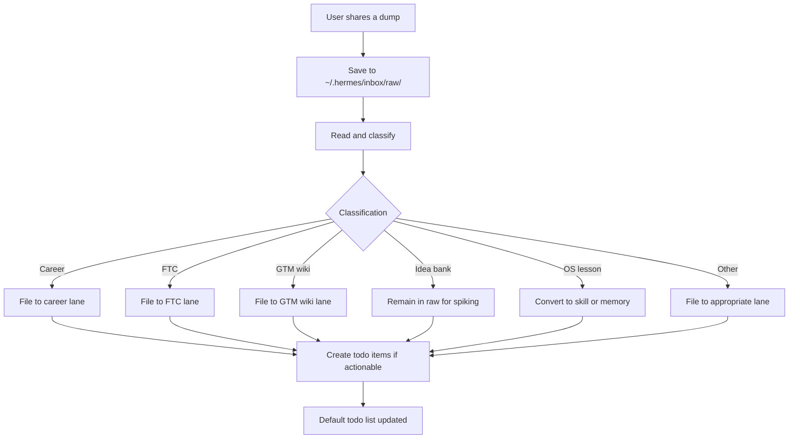

# Intake Capture Process

Every time the user shares a dump (a link, a note, an idea, a problem), Hermes follows the **intake capture** workflow to ensure nothing is lost and everything is turned into trackable work.

## Four Steps

1. **Capture** – The dump is saved as a raw file under `~/.hermes/inbox/raw/` with a timestamped name and the original source URL or description.
2. **Classify** – The dump is read and classified into one of the known lanes (e.g., career, FTC, GTM wiki, idea bank, OS lesson, etc.).
3. **File to home** – Based on the classification, the dump is moved (or copied) to its proper home:
   - Career → `~/thatch-knowledge/` or `~/.hermes/profiles/career/`
   - FTC → `~/.hermes/profiles/flying-tigers-co/`
   - GTM wiki → `~/gtm-wiki/` or `~/.hermes/inbox/wiki/`
   - Idea bank → `~/.hermes/inbox/raw/` (remains there for later spiking)
   - OS lesson → `~/.hermes/skills/` (as a new skill) or `~/.hermes/memory/` (as a note)
   - etc.
4. **Make tasks** – If the dump contains actionable items, they are added to the default todo list (visible in chat) with appropriate metadata (source, classification, priority).

## Diagrams

Below is a flowchart showing the intake capture process.

## Worked Example: Example for Intake‑Capture Process

Here’s a concrete example of how intake‑capture process works in practice.

1. **Scenario Setup**
   - Describe the starting state: goal, progress, evidence.
2. **Step 1: [First Action]**
   - What the agent does.
3. **Step 2: [Second Action]**
   - What happens next.
4. **Step 3: [Third Action]**
   - The outcome and verification.
5. **Result**
   - The final state and what was learned.

## Objection/Layer: What Could Break This and How We Mitigate

| Potential Failure | How It Happens | Mitigation in the OS |
|-------------------|----------------|----------------------|
| **Failure mode 1** | Description. | Mitigation. |
| **Failure mode 2** | Description. | Mitigation. |
| **Failure mode 3** | Description. | Mitigation. |

## Related Skills

- `intake-capture` – the skill that encapsulates this workflow (see `~/.hermes/skills/intake-capture/SKILL.md`).

---

> **Source:** GTM OS Handbook, 2026-08-27

> **Source:** GTM OS Handbook, 2026-08-27 
